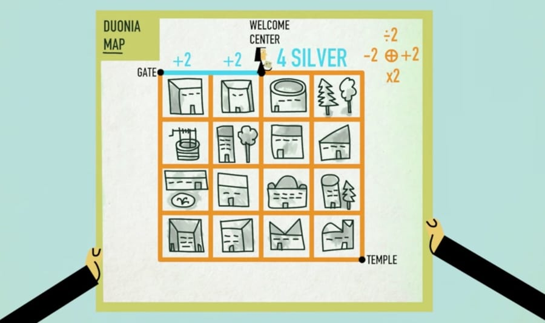

<div align="center" id="top"> 
  

  &#xa0;

  <!-- <a href="https://wander.netlify.app">Demo</a> -->
</div>

<h1 align="center">Wander</h1>

<p align="center">
  

  

  

</p>

<!-- Status -->

<!-- <h4 align="center"> 
	🚧  Wander 🚀 Under construction...  🚧
</h4> 

<hr> -->

<p align="center">
  <a href="#about">About</a> &#xa0; | &#xa0; 
  <a href="#puzzle-explanation">Puzzle Explanation</a> &#xa0; | &#xa0;
  <a href="#requirements">Requirements</a> &#xa0; | &#xa0;
  <a href="#starting">Starting</a> &#xa0; | &#xa0;
  <a href="https://github.com/fsunroo" target="_blank">Author</a>
</p>

<br>

## About ##

This project is a Reinforcement Learning Algorithm for Solving [penniless pilgrim riddle](https://www.youtube.com/watch?v=6sBB-gRhfjE) puzzle

this simple app consist of two parts: 1- wanderEnv 2-WanderAgent 

first one defines games enviroments, rules, moves and etc. while the latter is defining our Agents behaviour

0:Right 1:Down 2:Left 3:Up

the Agent will play the game more and more and each time learns a bit more of the game and completes his! Qtable, for more info pleas check [Reinforcement learning](https://en.wikipedia.org/wiki/Reinforcement_learning)
## Puzzle Explanation ##

After months of travel, you’ve arrived at Duonia, home to the famous temple that’s the destination of your pilgrimage. The walk from the welcome center to the temple isn’t a long one … but there’s a problem. Can you outsmart the city’s imposed tax and make it to the temple without paying a fee?

Your tax total begins at 4. Walk east one block, add 2. Walk west a block, subtract 2. Walk south one block and your total doubles, but you can divide your total for every block walked northward.

How can you get to the temple with a zero balance? And without walking the same path twice? Grab a pencil and paper to solve this puzzle

## Requirements ##

Before starting :checkered_flag:, you need to have numpy installed
##  Starting ##

```bash
# Clone this project
$ git clone https://github.com/fsunroo/wander

# Access
$ cd wander

# Install dependencies
$ pip3 install -r requirements.txt

# Run the project
$ python wanderAgent.py

```


Made with :heart: by <a href="https://github.com/fsunroo" target="_blank">Mohammad Fhd</a>

&#xa0;

<a href="#top">Back to top</a>
